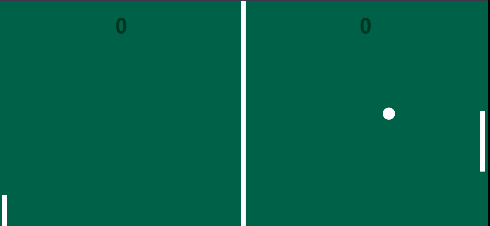

# Jogo Ping-Pong 🏓

## Descrição
O projeto do jogo de ping-pong foi desenvolvido durante as aulas de Lógica de Programação, no curso de Front End Master - Dev Samurai, utilizando HTML, CSS e JavaScript básico.  
O jogo, até o presente momento, não possui suporte para conectar dois jogadores diferentes, ou seja, você joga apenas contra a maquina. 

[]

## Como Funciona ? 
- Raquete Esquerda (humano):
    * Mover o mouse para cima e para baixo conforme a bolinha bater.  

- Raquete Direita (computador): 
    * Movimentos pré-programados. A raquete se move para cima e para baixo.  

- Score:
    * Placar que marca os pontos assim que a bolinha passar da raquete de ambos os jogadores.

    * Obs: A velocidade da bolinha aumenta de acordo com a quantidade de pontos feitos. 

## Tecnologias Utilizada
- HTML e CSS: Criação e estilização dos elementos da página.

- JavaScript: Manipulação do Canvas, captura dos eventos do mouse e funcionamento de todo algoritmo do jogo.